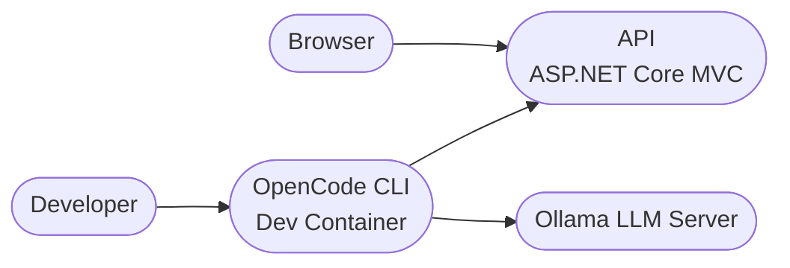

# OpenCode + Ollama | Fábio R. Nóbrega

This setup extends the local Docker development environment by adding **OpenCode + Ollama** for AI-assisted development inside the same repository used by the ASP.NET Core MVC application.

It enables a fully local workflow where a coding agent can analyze and modify the project while running inside the same Docker network as the API.

The environment integrates with the existing stack described in this repository.

We use:

- OpenCode CLI (local coding agent)
- Ollama (local LLM inference)
- Qwen3.5 Coder (`qwen3.5:0.8b`)
- Docker + Docker Compose
- Makefile-driven workflows
- ASP.NET Core MVC API container

---

## Table of Contents

- [Install](#install)
- [Usage](#usage)
- [Architecture](#architecture)
- [Configuration](#configuration)
- [Troubleshooting](#troubleshooting)
- [Development Workflow](#development-workflow)

---

## Install

From the repository root:

```bash
git clone <repo-url>
cd codex-local-demo
```

Ensure Docker Desktop (or Docker Engine) is installed and running.

Copy environment configuration:

```bash
cp .env.example .env
```

Build the images:

```bash
make docker-build
```

Start the stack:

```bash
make docker-run
```

This launches:

- `api` → ASP.NET Core MVC application (port `8080`)
- `ollama` → local LLM inference server
- `opencode` → development agent container

---

## Usage

Once the stack is running, open the application:

```
http://localhost:8080/
```

Available routes:

- `/` → MVC Home page
- `/health` → Health endpoint

Useful commands:

```bash
make api-logs
make logs
make api-restart
make docker-down
```

To launch the OpenCode coding agent:

```bash
make opencode-run
```

The repository is mounted inside the container at:

```
/workspace
```

You can also open a shell in the OpenCode container:

```bash
make opencode-shell
```

---

## Architecture

### Service Overview



---

## Configuration

OpenCode loads configuration from:

```
opencode.json
```

Inside the container this file is mounted at:

```
/root/.config/opencode/opencode.json
```

Default provider configuration:

| Setting | Value |
|------|------|
| Provider ID | `ollama` |
| Display name | `Ollama (docker)` |
| Base URL | `http://ollama:11434/v1` |
| Model ID | `qwen3.5:0.8b` |
| Default model | `ollama/qwen3.5:0.8b` |

The environment automatically pulls the required model during container startup.

If you want to run a different model:

```
MODEL=<model-name>
```

Example:

```bash
MODEL=qwen2.5-coder make opencode-run
```

---

## Troubleshooting

### Ollama container not responding

Check logs:

```bash
make ollama-logs
```

Test the model:

```bash
make ollama-chat
```

---

### OpenCode cannot connect to Ollama

Verify the API endpoint inside `opencode.json`:

```
http://ollama:11434/v1
```

If running OpenCode outside Docker use:

```
http://localhost:11434/v1
```

---

### Clean rebuild

If containers behave unexpectedly:

```bash
make docker-down
make docker-build
make docker-run
```

---

## Development Workflow

Typical development cycle:

1. Start environment

```bash
make docker-run
```

2. Start OpenCode

```bash
make opencode-run
```

3. Ask the coding agent to analyze or modify the repository.

4. Restart the project if needed:

```bash
make api-restart
```
